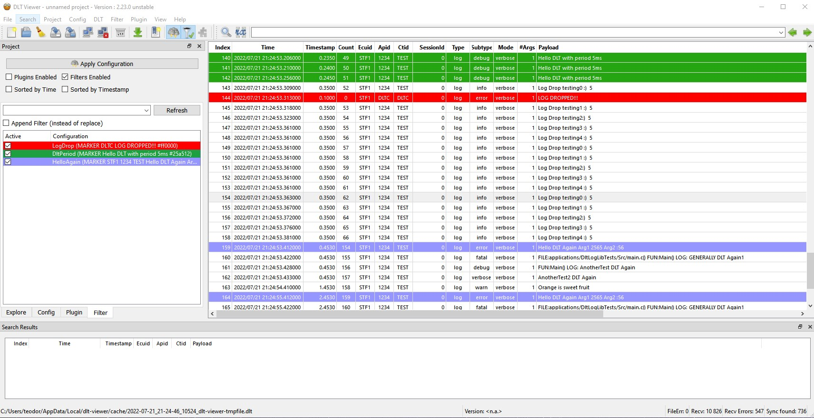
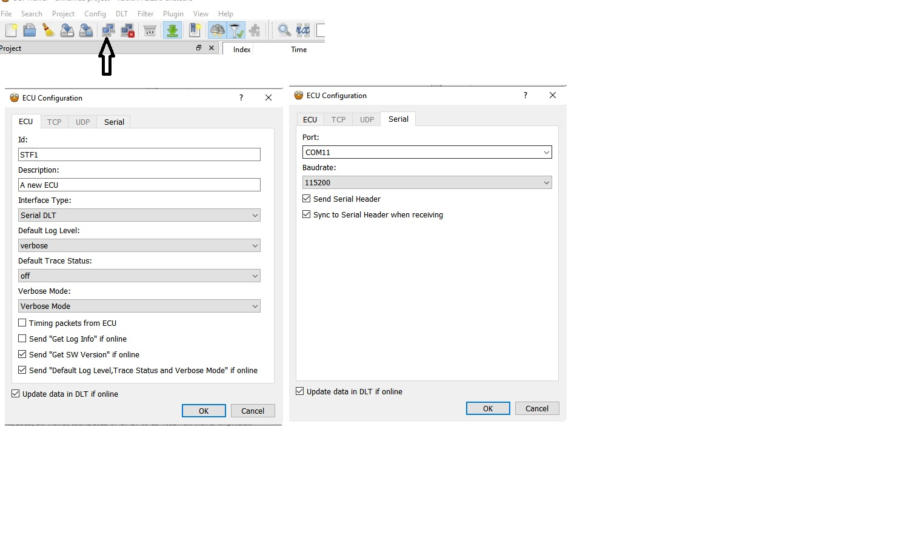
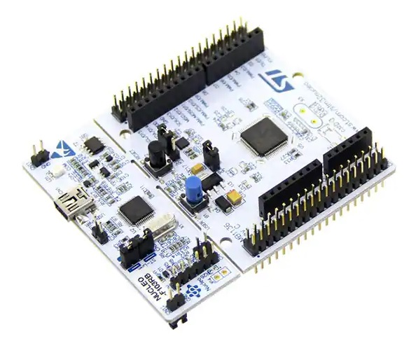

# MCU_DLT_LOGS_LIB
DLTuc - it's a simple library to send DLT logs from MCU like STM32 or any other MCU. The logs may be send through serial communication interface like USART/UART. Each message is stored in a ring buffer, then transmitted. Thanks to this approach, a queue of messages to send is created

**_Lib. source files are located in: src/*_**

Prepared library should work correctly with Real Time Operation System(RTOS) after correct configuration (check file: src/DLTucConfig_template)

Demo Video: (english captions available)
 * https://youtu.be/htQmj42eDHw

To view these logs i used the DLT-Viewer:
 * https://github.com/COVESA/dlt-viewer

ECU Config:

This program is very useful to filtering and marking logs using "Markers".

This lib. is very simple, and support only small part of dlt logs possibilities, however in my opinion it's usefull solution.

**_Detailed instruction you can find in: src/DLTuc.h_**

Provided examples were tested on NUCLEO STM32F103RB board, DLT_Viewer 2.23, and with my simple nnRTOS:

https://github.com/trteodor/nnRTOS__Nihil-Novi-RTOS

If you want just check the library, compiled binaries are included at:
examples\binaries

You are ready to compile source and load firmware if you have listed tools in your environment: (environment variables)

    * arm-none-eabi-gcc 9.3.1

    * OpenOCD 0.11.0

    * make 3.81 or newer

Finally just call "make" in command line in directory of the project.

# References:

https://github.com/COVESA/dlt-viewer

https://github.com/COVESA/dlt-daemon

https://www.autosar.org/fileadmin/user_upload/standards/foundation/1-0/AUTOSAR_PRS_DiagnosticLogAndTraceProtocol.pdf

https://qiita.com/takeoverjp/items/d7a9ad4e5f0b778308be

https://medium.com/inatech/about-your-next-automotive-friendly-prototype-53ce5f2923e7

#stm32 #dlt #viewer #debug #log #logs #mcu #microcontroller #data #log #diagnostic #and #trace
